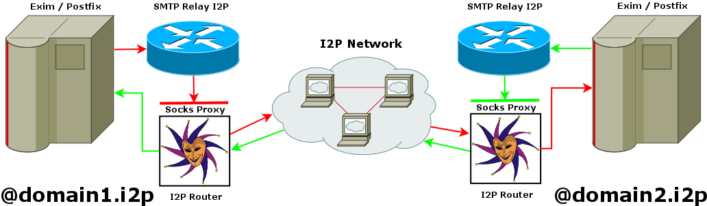

## Building & Running
```
go get (to get all required packages)
```
```
go build .
```
* For debugging or running in terminal (listen port is set in mailserver smarthost config) :
```
smtprelay -listen '127.0.0.1:7658' -log_level 'debug' -proxy_i2p '127.0.0.1:4447'
```
* For production setups you can use openrc/systemd configurations provided - [[**services**](services)]
* Optionally, you can use automated installation script :
```
sudo ./install.sh
```
* Specific configurations for Exim4/Postifx as well as neomutt are provided as well - [[**MTA config**](docs)]

* To test the validity of your __smtprelay-I2P__ setup, just send an email to __apophis@pubsub.i2p__
## Overview and Features

* __smtprelay-I2P__ is based on decke/smtprelay project adapted to I2P environment - [[**decke/smtprelay**](README_smtprelay.md)] 
* Generally, I2P has neither need nor place for DNS like service/records as all address routing is direct. This new paradigm requires some sort of ***agreement*** in between MTA operators on ***mail domain naming*** scheme.
* Basically, mailserver domain name and domain served by MTA must be ***identical***.
* I2P inter server MTA communication is the goal of this project and thus, we ask all I2P MTA operators to use this domain naming scheme to allow for wide I2P MTA federation.


## What's next
* Allow TLS and other AUTH methods over I2P connections ( in case some "genius" needs certificates )
* Kill All Humans ?
